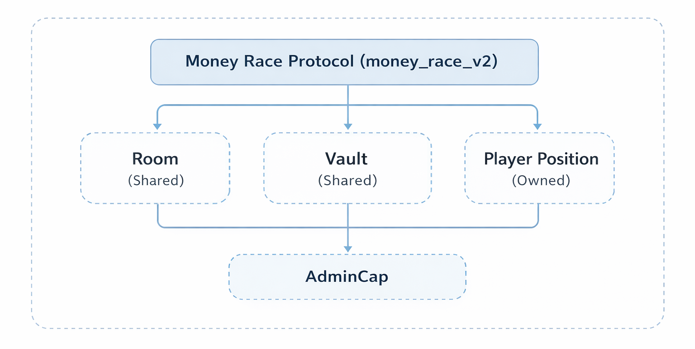

# Smart Contracts

## Overview

Money Race is powered by **Sui Move** smart contracts deployed as the `money_race_v2` module. All core protocol logic—room management, periodic deposits, and proportional reward distribution—is handled on-chain with **100% gasless** transactions for users.

**Key Characteristics:**
- 🔐 **Non-custodial** — Users control funds via PlayerPosition NFTs
- 🆓 **Gasless** — Backend sponsors all gas fees (users pay zero SUI)
- 📊 **Proportional** — Rewards based on consistency, NO penalties
- 🏦 **Vault-based** — Separate principal and reward balances

---

## Contract Architecture





**Design Pattern:** Object-centric architecture where Room and Vault are shared objects, while PlayerPosition is an owned NFT giving users exclusive control over their participation.

---

## Core Structs

### 1. AdminCap

Admin capability object for privileged operations:

```move
public struct AdminCap has key, store {
    id: UID
}
```

**Used for:**
- Starting rooms (`start_room()`)
- Finalizing rooms (`finalize_room()`)

---

### 2. Room

The savings room object (shared):

```move
public struct Room has key, store {
    id: UID,
    total_periods: u64,         // Total number of periods (e.g., 7 for daily 7-day room)
    deposit_amount: u64,        // USDC per deposit (6 decimals, e.g., 10_000_000 = 10 USDC)
    strategy_id: u8,            // 1=Conservative, 2=Balanced, 3=Aggressive
    status: u8,                 // 0=OPEN, 1=ACTIVE, 2=FINISHED
    start_time_ms: u64,         // Unix timestamp when room starts
    period_length_ms: u64,      // Duration per period (86400000 = 1 day, 604800000 = 1 week)
    total_weight: u64           // Sum of all deposited_count (used for proportional calculation)
}
```

**Status Lifecycle:**
```
OPEN (0) → ACTIVE (1) → FINISHED (2)
```

**Period Calculation:**
```move
current_period = (now - start_time_ms) / period_length_ms
```

**Examples:**
```
Daily Room: period_length_ms = 86400000 (24 hours)
- Day 0: Period 0
- Day 1: Period 1
- Day 7: Period 7

Weekly Room: period_length_ms = 604800000 (7 days)
- Week 0: Period 0
- Week 1: Period 1
- Week 4: Period 4
```

---

### 3. Vault

Holds all deposited funds (shared):

```move
public struct Vault has key, store {
    id: UID,
    principal: Balance<USDC>,   // Original deposits
    reward: Balance<USDC>       // Accumulated yield
}
```

**Balance Flow (Testnet Simulation):**
```
Deposit → principal increases
accrue_yield() → moves principal to reward (simulates external yield)
Claim → proportional split of both principal and reward
```

**Mainnet (Future):**
```
Deposit → principal stays intact
External DeFi yield → reward increases (from Scallop, Navi, Cetus, etc.)
Claim → 100% principal + proportional reward share
```

---

### 4. PlayerPosition

User's participation NFT (owned by player):

```move
public struct PlayerPosition has key, store {
    id: UID,
    owner: address,             // Player wallet address
    deposited_count: u64,       // Number of successful deposits made
    last_period: u64,           // Last period when deposit was made
    claimed: bool               // Whether rewards have been claimed
}
```

**Key Fields:**
- `deposited_count` — Used to calculate proportional share (`deposited_count / total_weight`)
- `last_period` — Prevents double-depositing in same period
- `claimed` — Ensures one-time claim only

---

## Constants

### Room Status
```move
const STATUS_OPEN: u8 = 0;      // Accepting participants
const STATUS_ACTIVE: u8 = 1;    // Challenge in progress
const STATUS_FINISHED: u8 = 2;  // Ready for claims
```

### Strategy IDs
```move
const STRATEGY_CONSERVATIVE: u8 = 1;    // ~4% APY
const STRATEGY_BALANCED: u8 = 2;        // ~8% APY
const STRATEGY_AGGRESSIVE: u8 = 3;      // ~15% APY
```

### Yield Rates (Testnet Simulation)
```move
const CONSERVATIVE_BPS: u64 = 40;       // 0.4% (4% APY simulated)
const BALANCED_BPS: u64 = 80;           // 0.8% (8% APY simulated)
const AGGRESSIVE_BPS: u64 = 150;        // 1.5% (15% APY simulated)
```

> **Note:** Basis points (bps) where 100 bps = 1%. Testnet simulates yield by moving principal to reward pool. Mainnet will integrate real DeFi protocols.

---

## Entry Functions

### create_room()

Create a new savings room:

```move
public entry fun create_room(
    total_periods: u64,         // Number of periods (e.g., 7 for 7-day daily room)
    deposit_amount: u64,        // USDC per deposit (6 decimals)
    strategy_id: u8,            // 1, 2, or 3
    start_time_ms: u64,         // Unix timestamp (milliseconds)
    period_length_ms: u64,      // Period duration (ms)
    ctx: &mut TxContext
)
```

**Creates:**
- Room object (shared)
- Vault object (shared)

**Emits:** `RoomCreated` event

**Example:**
```typescript
// 7-day daily room, 10 USDC per day, Balanced strategy
tx.moveCall({
  target: `${PACKAGE_ID}::money_race_v2::create_room`,
  arguments: [
    tx.pure(7),          // 7 periods
    tx.pure(10_000_000), // 10 USDC (6 decimals)
    tx.pure(2),          // Balanced
    tx.pure(Date.now()), // Start now
    tx.pure(86400000),   // 1 day per period
  ],
});
```

---

### start_room()

Admin starts the room (moves from OPEN to ACTIVE):

```move
public entry fun start_room(
    _admin: &AdminCap,
    room: &mut Room
)
```

**Requirements:**
- Caller must have AdminCap
- Room status must be OPEN

---

### join_room()

Join room and make first deposit (period 0):

```move
public entry fun join_room(
    room: &mut Room,
    vault: &mut Vault,
    clock: &Clock,
    coin: Coin<USDC>,
    ctx: &mut TxContext
)
```

**Requirements:**
- Room status must be ACTIVE
- Current period must be 0 (first period)
- Coin amount must equal `room.deposit_amount`

**Effects:**
- Deposit added to vault.principal
- PlayerPosition NFT created and transferred to user
- `room.total_weight` increases by 1
- `accrue_yield()` called to simulate yield

**Emits:** `PlayerJoined` event

---

### deposit()

Make periodic deposit (periods 1+):

```move
public entry fun deposit(
    room: &mut Room,
    vault: &mut Vault,
    player: &mut PlayerPosition,
    clock: &Clock,
    coin: Coin<USDC>
)
```

**Requirements:**
- Room status must be ACTIVE
- Current period < total_periods
- Current period > player.last_period (prevents double deposit)
- Coin amount must equal `room.deposit_amount`

**Effects:**
- Deposit added to vault.principal
- `player.deposited_count` increases by 1
- `player.last_period` updated to current period
- `room.total_weight` increases by 1
- `accrue_yield()` called to simulate yield

**Emits:** `DepositMade` event

---

### finalize_room()

Admin finalizes room (moves from ACTIVE to FINISHED):

```move
public entry fun finalize_room(
    _admin: &AdminCap,
    room: &mut Room,
    vault: &mut Vault
)
```

**Requirements:**
- Caller must have AdminCap
- Room status must be ACTIVE
- `room.total_weight` > 0 (at least one deposit made)

**Effects:**
- Final `accrue_yield()` called
- Room status set to FINISHED

---

### claim_all()

Claim proportional principal + reward:

```move
public entry fun claim_all(
    room: &mut Room,
    vault: &mut Vault,
    player: &mut PlayerPosition,
    ctx: &mut TxContext
)
```

**Requirements:**
- Room status must be FINISHED
- `player.claimed` must be false (one-time claim)

**Proportional Distribution Formula:**
```move
reward_share = (player.deposited_count * vault.reward) / room.total_weight
principal_share = (player.deposited_count * vault.principal) / room.total_weight
```

**Effects:**
- Two Coin<USDC> transfers to player.owner:
  - principal_coin (proportional principal)
  - reward_coin (proportional yield)
- `player.claimed` set to true
- `room.total_weight` decreased by player.deposited_count

**Emits:** `RewardsClaimed` event

**Example:**
```
Room: 5 periods, 3 players
- Alice: deposited 5 times
- Bob: deposited 4 times
- Carol: deposited 2 times
Total weight: 11

Vault: 110 USDC principal, 10 USDC reward

Alice claims:
- principal = (5 × 110) / 11 = 50 USDC
- reward = (5 × 10) / 11 = 4.545 USDC
- Total: 54.545 USDC ✅
```

---

## Internal Functions

### current_period()

Calculate which period the room is currently in:

```move
fun current_period(room: &Room, clock: &Clock): u64 {
    let now = sui::clock::timestamp_ms(clock);
    assert!(now >= room.start_time_ms, E_NOT_STARTED);
    (now - room.start_time_ms) / room.period_length_ms
}
```

---

### accrue_yield()

Simulate external yield (testnet only):

```move
fun accrue_yield(room: &Room, vault: &mut Vault) {
    // Determine yield rate by strategy
    let rate_bps = 40 (Conservative) | 80 (Balanced) | 150 (Aggressive);

    // Calculate yield amount
    let yield_amount = (vault.principal × rate_bps) / 10_000;

    // Move principal to reward pool (simulation)
    balance::split(&mut vault.principal, yield_amount);
    balance::join(&mut vault.reward, yield_balance);
}
```

> **Testnet Simulation:** Yield is simulated by moving principal to reward pool, creating a zero-sum environment for demo purposes.
>
> **Mainnet:** This function will integrate with real Sui DeFi protocols (Scallop, Navi, Cetus, Turbos, Kriya, Aftermath) to generate genuine external yield, keeping principal 100% intact.

---

## Events

### RoomCreated
```move
public struct RoomCreated has copy, drop {
    room_id: ID,
    vault_id: ID,
    strategy_id: u8
}
```

### PlayerJoined
```move
public struct PlayerJoined has copy, drop {
    room_id: ID,
    vault_id: ID,
    player: address,
    player_position_id: ID,
    amount: u64
}
```

### DepositMade
```move
public struct DepositMade has copy, drop {
    room_id: ID,
    player: address,
    period: u64,        // Current period (NOT "week")
    amount: u64
}
```

### YieldAccrued
```move
public struct YieldAccrued has copy, drop {
    room_id: ID,
    amount: u64
}
```

### RewardsClaimed
```move
public struct RewardsClaimed has copy, drop {
    room_id: ID,
    player: address,
    principal: u64,     // Proportional principal share
    reward: u64         // Proportional reward share
}
```

---

## Security Features

✅ **Object Ownership Model**
- PlayerPosition is owned by user (non-custodial)
- Room and Vault are shared objects (transparent state)

✅ **Access Control**
- AdminCap required for privileged operations
- PlayerPosition ownership verified on-chain

✅ **Balance Safety**
- Proper `Balance<USDC>` handling with `balance::split()` and `balance::join()`
- No direct coin manipulation

✅ **Double-Deposit Prevention**
- `player.last_period` prevents depositing twice in same period

✅ **One-Time Claim**
- `player.claimed` boolean ensures single claim only

✅ **Time-Based Logic**
- Clock object used for accurate period calculation
- No reliance on block timestamps

✅ **Safe Math**
- All arithmetic uses u64 with proper overflow checks
- Proportional distribution using integer division

---

## Gasless Transactions

**Money Race is 100% gasless for users.**

**How it works:**
1. User signs transaction with their wallet/zkLogin
2. Backend adds **sponsor signature** using Gas Station pattern
3. Backend pays gas in SUI
4. User only needs USDC, zero SUI required

**Sponsored Operations:**
- `create_room()` → Gasless ✅
- `join_room()` → Gasless ✅
- `deposit()` → Gasless ✅
- `claim_all()` → Gasless ✅

**Backend Implementation:**
```typescript
// Backend sponsors gas for user transaction
const sponsoredTx = await sponsorTransaction(userSignedTx);
await client.executeTransactionBlock({
  transactionBlock: sponsoredTx,
  signature: [userSignature, sponsorSignature],
});
```

---

## Testnet vs Mainnet

| Aspect | Testnet (Current) | Mainnet (Coming) |
|--------|------------------|------------------|
| **Yield Source** | Simulated (moves principal to reward) | Real (external DeFi protocols) |
| **Principal** | Reduced by yield simulation | 100% intact |
| **Protocols** | None (simulation only) | Scallop, Navi, Cetus, Turbos, Kriya, Aftermath |
| **APY** | Fixed (4%/8%/15%) | Variable (market rates) |
| **accrue_yield()** | Cuts from principal | Adds from DeFi protocols |

---

## Example Flow

**Complete User Journey:**

```typescript
// 1. Admin creates room
create_room(7, 10_000_000, 2, Date.now(), 86400000);

// 2. Admin starts room
start_room(adminCap, room);

// 3. Alice joins (period 0)
join_room(room, vault, clock, usdcCoin);
// → Alice gets PlayerPosition NFT

// 4. Alice deposits (periods 1-6)
deposit(room, vault, alicePosition, clock, usdcCoin);
// → Repeat for each period

// 5. Admin finalizes
finalize_room(adminCap, room, vault);

// 6. Alice claims
claim_all(room, vault, alicePosition);
// → Alice receives principal + reward proportionally
```

---

## Contract Deployment

**Package ID (Testnet):**
```
0x0e5bb307c15081e2159f2a3a4d4aa509bd0ed1cda6338accf4189e734c5f122c
```

**Module Name:**
```
money_race_v2
```

**View on Sui Explorer:**
[https://suiexplorer.com/object/0x0e5bb307c15081e2159f2a3a4d4aa509bd0ed1cda6338accf4189e734c5f122c?network=testnet](https://suiexplorer.com/object/0x0e5bb307c15081e2159f2a3a4d4aa509bd0ed1cda6338accf4189e734c5f122c?network=testnet)

---

[Next: Deployments →](deployments.md)
