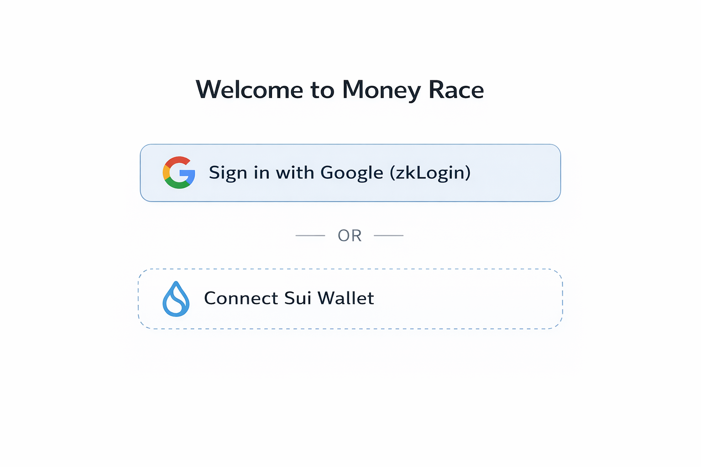
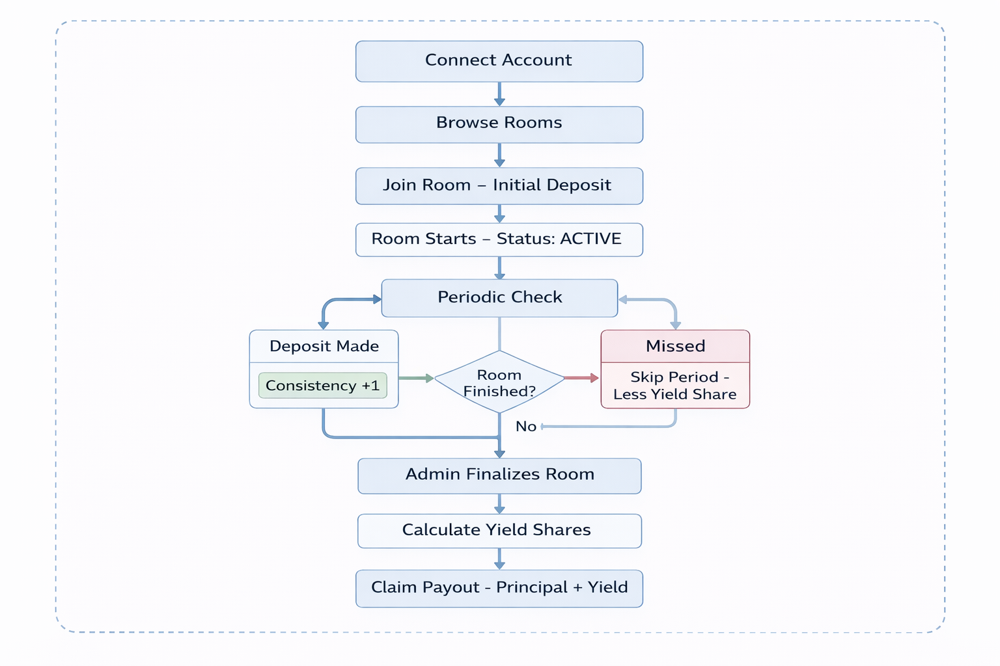

# How It Works

Complete user journey from sign-up to earning rewards on Money Race.

---

## 🚀 Getting Started

### Step 1: Connect Your Account

Two options to get started — **both gasless**:



**Google Login (zkLogin):**
- No wallet needed — one-click sign-in
- Automatic keypair generation
- Perfect for Web2 users

**Wallet Connect:**
- Direct Sui wallet integration (dapp-kit)
- Full control of your keys
- Supports all major Sui wallets

**All transactions are gasless** — backend sponsors gas fees.

---

### Step 2: Browse Savings Rooms

Explore available rooms on the dashboard:

| Room Info | Example |
|-----------|---------|
| **Name** | "Daily Savers Club" |
| **Duration** | 14 days (minimum 7 days) |
| **Deposit Amount** | 10 USDC |
| **Period** | Daily (or Weekly) |
| **Participants** | 12/20 |
| **Strategy** | Balanced (~8% APY) |
| **Status** | OPEN |

---

### Step 3: Join a Room

1. Select a room matching your savings goal
2. Review parameters (duration, amount, strategy)
3. Get AI recommendation (optional) → EigenAI analyzes your prompt
4. Make initial deposit (gasless!)
5. You're in! 🏁

**No gas fees** — just deposit USDC.

---

### Step 4: Periodic Deposits

Make deposits each period to stay consistent:

```
Period 1: ✅ 10 USDC deposited
Period 2: ✅ 10 USDC deposited
Period 3: ⏳ Current period (5 days left)
Period 4: 🔒 Future period
```

**Period Length:** Daily or Weekly (set when room is created)

**Important:**
- Miss a deposit → You get less yield share (NOT penalized on principal)
- Your principal is always safe
- Consistency = higher reward share

---

### Step 5: Track Your Progress

Monitor performance on the dashboard:

- **Total Deposited** — How much you've saved
- **Consistency** — Deposits made / Total periods
- **Room Status** — OPEN / ACTIVE / FINISHED
- **Your Share** — Estimated % of yield pool
- **Yield Projection** — Expected rewards based on current rate

---

### Step 6: Claim Rewards 🏆

When room is FINISHED, claim your payout:

```
Room Complete!

Your Stats:
├── Periods Completed: 5/5 (100%)
├── Total Deposited: 500 USDC
├── Your Share: 45.45% of yield pool
└── Yield Earned: 4.5 USDC

Total Payout: 504.5 USDC
  ├── Principal: 500 USDC (100% returned ✅)
  └── Yield: 4.5 USDC (from DeFi protocols)
```

**Claim is gasless** — funds sent to your wallet instantly.

---

## 📊 Flow Diagram



---

## How Yield is Distributed

**Proportional to consistency:**

```
Your Yield Share = (your_deposits / total_deposits) × total_yield
```

**Example:** Room with 11 total deposits, 10 USDC yield
- Alice (5 deposits) → 5/11 × 10 = 4.545 USDC
- Bob (4 deposits) → 4/11 × 10 = 3.636 USDC
- Carol (2 deposits) → 2/11 × 10 = 1.818 USDC

**Everyone gets principal back 100%.** Yield is the bonus for consistency.

---

## Technical Flow

For developers:

| Step | Action | Smart Contract | Gasless? |
|------|--------|---------------|---------|
| 1 | **Auth** | zkLogin or wallet signature | N/A |
| 2 | **Join Room** | `join_room()` + first deposit | ✅ Yes |
| 3 | **Periodic Deposit** | `deposit()` with USDC | ✅ Yes |
| 4 | **Admin Start** | `start_room()` (admin) | ✅ Yes |
| 5 | **Admin Finalize** | `finalize_room()` (admin) | ✅ Yes |
| 6 | **Claim Rewards** | `claim_all()` → principal + yield | ✅ Yes |

**How gasless works:**
- User signs transaction with their key
- Backend adds sponsor signature (multi-sig)
- Sponsor pays gas in SUI
- User only needs USDC

---

## Smart Contract Events

All actions emit events for transparency:

- `RoomCreated` → New room initialized
- `PlayerJoined` → User joins with first deposit
- `DepositMade` → Periodic deposit recorded
- `YieldAccrued` → Yield calculated and moved to reward pool
- `RewardsClaimed` → User withdraws principal + yield

---

[Next: Savings Rooms →](savings-rooms.md)
